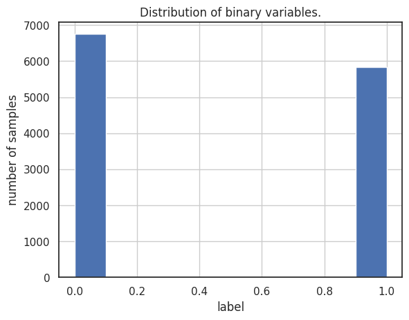
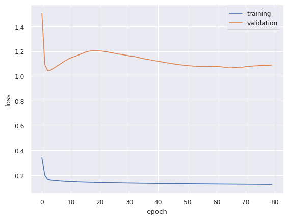
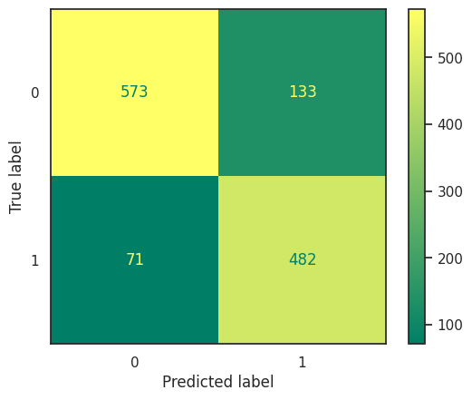

# Introduction
## Cytochrome P450
Cytochrome P450 is a part of the group of enzymes active in monooxygenase activity. They are found in almost all tissues, they show activity showing the same liver and adrenal medulla.
In the human genome, there are about 150 different genes encoding different cytochromes P450. Found among all domains of bacteria: bacteria, archaea, animals, plants, fungi and other nuclear organisms, and even among viruses. [1]
The CYP P450 genes are involved in the formation and breakdown (metabolism) of various molecules and chemicals within cells.

This project focuses on predicting inhibition of CYP1A2.  
Specifically, this enzyme localizes to the endoplasmic reticulum and its expression is induced by some polycyclic aromatic hydrocarbons (PAHs), some of which are found in cigarette smoke. It is able to metabolize some PAHs to carcinogenic intermediates. Other xenobiotic substrates for this enzyme include caffeine, aflatoxin B1, and acetaminophen.

The computional approach of predicting the inhibition can be useful way of speeding the process of new drugs discovery linked to CYP enzymes by reducing costs and time of a laboratory research.

The dataset consists of binary classification of CYP1A2 inhibition and correspodning molecules in SMILES format. [2]

# Data preparation

ADME BINARY

    [Text(0.5, 0, 'label'),
     Text(0, 0.5, 'number of samples'),
     Text(0.5, 1.0, 'Distribution of binary variables.')]

    

    

    Dataset:  cyp1a2_veith
    all molecules : 12579
    active ones: 5829 , 46.34 % 
    

First 5 records of dataset:

  

    

      

<table border="1" class="dataframe">
  <thead>
    <tr style="text-align: right;">
      <th></th>
      <th>Drug_ID</th>
      <th>Drug</th>
      <th>Y</th>
    </tr>
  </thead>
  <tbody>
    <tr>
      <th>0</th>
      <td>6602638.0</td>
      <td>CCCC(=O)Nc1ccc(N2CCN(CC)CC2)c(Cl)c1.Cl</td>
      <td>0</td>
    </tr>
    <tr>
      <th>1</th>
      <td>644510.0</td>
      <td>O=c1[nH]c2cc3c(cc2cc1CN(CCCO)Cc1nnnn1Cc1ccc(F)...</td>
      <td>1</td>
    </tr>
    <tr>
      <th>2</th>
      <td>1960010.0</td>
      <td>CCN1C(=O)/C(=C2\SC(=S)N(CCCOC)C2=O)c2ccccc21</td>
      <td>1</td>
    </tr>
    <tr>
      <th>3</th>
      <td>644675.0</td>
      <td>CC(=O)N(c1ccc2oc(=O)sc2c1)S(=O)(=O)c1cccs1</td>
      <td>1</td>
    </tr>
    <tr>
      <th>4</th>
      <td>644851.0</td>
      <td>Clc1ccccc1-c1nc(-c2ccccc2)n[nH]1</td>
      <td>1</td>
    </tr>
  </tbody>
</table>

      <button class="colab-df-convert" onclick="convertToInteractive('df-f4d45967-b75a-4d15-97fd-bd6019b11117')"
              title="Convert this dataframe to an interactive table."
              style="display:none;">

</svg>
      </button>
    

    Is there any missing values in columns:
    Drug_ID : False
    Drug : False
    Y : False

Visualisation of some molecules in the dataset:

    Label "1" examples:

    

    

    Label "0" examples:

    

    

## Encoding molecules to graphs for learning [3]

Example of encoded molecule for training:

    Data(x=[34, 76], edge_index=[2, 76], edge_attr=[76, 10], y=[1])

## TRAINING
The dataset was divided into training set (70%), validation set (20%) and test set (10%).
The network consists of five convolutional layers with
modifiable embedding size. The parameters are edge indexes which tells about geometry of molecule and edge attributes which has information about properites of the bonds and atoms.

Model architecture:

- input matrix N x N, graph with connection of atoms and their attributes

- one hot encoding of variables, sparse matrix

- 5 hidden layers

- combination of max and mean in the pooling layer

    GNN(
      (conv1): GATConv(76, 32, heads=1)
      (conv2): GATConv(32, 32, heads=1)
      (conv3): GATConv(32, 32, heads=1)
      (conv4): GATConv(32, 32, heads=1)
      (conv5): GATConv(32, 32, heads=1)
      (out): Linear(in_features=64, out_features=1, bias=True)
    )

# Results

Network was trained on different hyperparamters. The learning rate, embedding size and number of epochs were changed. The best result was obtained for LR = 0.0001, EMBEDDING = 64, EPOCHS = 80. Manipulating the batch size gave higher training loss than validation and increasing curve shape. The accuracy was computed based on the test dataset which was not previously seen by the model. The best result was for batch size 32 and all trianings presented below have this value set.
Moreover, the learing rate lower than 0.0001 classified all samples as 0 which was poor performance (accuracy ~50%), the same result with much higher learning rate. Extending number of epochs did not make big difference in the results.

      Embedding size    Number of epochs    Learning rate    Accuracy [%]
    ----------------  ------------------  ---------------  --------------
                  64                  80           0.0001           83.8
                  64                 120           0.0001           83.24
                  64                  50           0.0001           82.37
                  64                  30           0.0001           81.18
                  32                  50           0.0001           82.29
                  32                  50           0.01             79.27
                  32                  30           0.0001           81.18
                  32                  30           1e-06            56.04
                   8                  50           0.0001           78.47
                   8                  30           0.0001           75.54
                   8                  30           1e-06            56.08

## Final model
The best model result of training process is presented below.

    accuracy: 83.8 %

    

    

    

    

# Refrences
1.  David C. Lamb, Li Lei, Andrew G. S. Warrilow, Galina I. Lepesheva, Jonathan G. L. Mullins, Michael R. Waterman and Steven L. Kelly. The first virally encoded cytochrome p450. „Journal of Virology”. 83 (16), s. 8266–8269, 2009. DOI: 10.1128/JVI.00289-09.
2. Veith, Henrike et al. “Comprehensive characterization of cytochrome P450 isozyme selectivity across chemical libraries.” Nature biotechnology vol. 27,11 (2009): 1050-5.
3. Encoding: https://www.blopig.com/blog/2022/02/how-to-turn-a-smiles-string-into-a-molecular-graph-for-pytorch-geometric/
